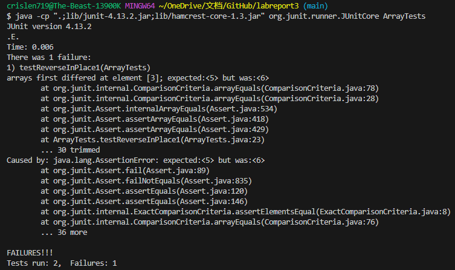

# Lab Report 3 - Bugs and Commands <br />
### Part 1 - Bugs
One bug program we chose for this lab report would be reverseInPlace in ArrayTests.java. The code before the change and has bug is shown below:

```
static void reverseInPlace(int[] arr) {
    for(int i = 0; i < arr.length; i += 1) {
      arr[i] = arr[arr.length - i - 1];
    }
  }
```
<br />
A failure-inducing input for the buggy program is shown below:

```
@Test 
	public void testReverseInPlace1() {
    int[] input1 = {3, 4, 5, 6, 7, 8};
    ArrayExamples.reverseInPlace(input1);
    assertArrayEquals(new int[]{8, 7, 6, 5, 4, 3}, input1);
	}
```

<br />
An input that doesn't induce a failure is shown below:

```
@Test 
	public void testReverseInPlace() {
    int[] input1 = { 3 };
    ArrayExamples.reverseInPlace(input1);
    assertArrayEquals(new int[]{ 3 }, input1);
	}
```
<br />

The screenshot of the symptom as the output of running the test by using JUnit is shown below:
 <br />

The bug program we chose for this lab report after change and fix the bug is shown below:

```
  static void reverseInPlace(int[] arr) {
    int temp;
    for(int i = 0; i < arr.length/2; i += 1) {
      temp = arr[i];
      arr[i] = arr[arr.length - i - 1];
      arr[arr.length - i - 1] = temp;
    }
  }
```

The output showing the test cases are passed by running JUnit is shown in the screenshot:


